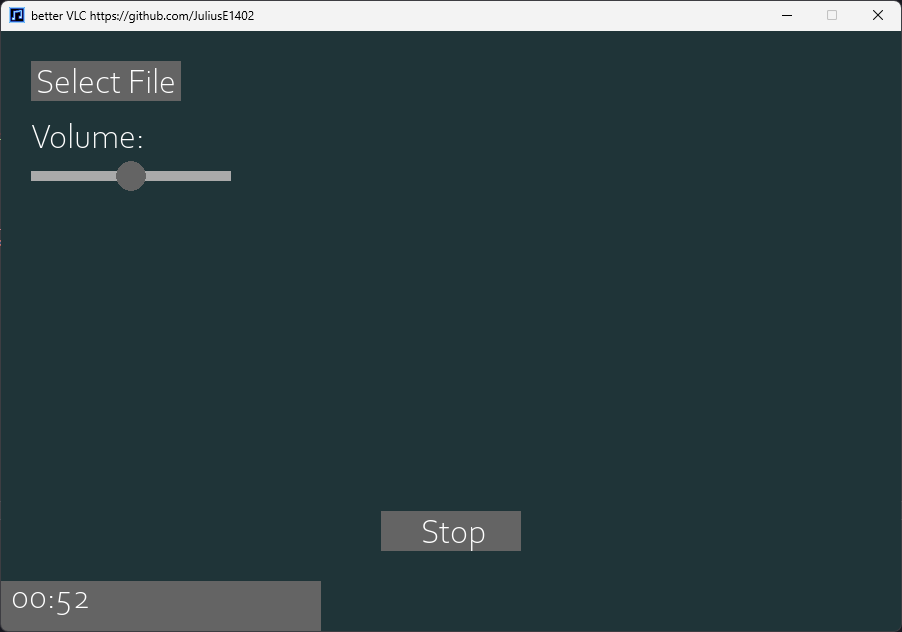

  
↓ Click to see a preview of the media player on YouTube ↓

  

# **Better VLC: A Media Player**
BVLC emerged as a project born out of the exploration of Python programming. Primarily designed as a straightforward media player, BVLC offers essential functionality with a minimalist approach.
  

# **Licensing**
This project is licensed under the MIT License, chosen for its open-source nature, legal clarity, and promotion of collaboration. The MIT License allows users to freely use, modify, and distribute the software, aligning with the principles of the open-source community.
